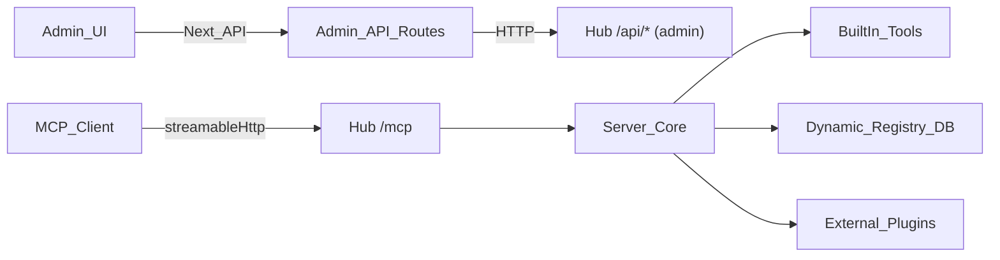

# Architecture — RS4IT MCP Hub (current)

## Repository layout

```
rs4it mcp/
  apps/
    backend/   # MCP Hub runtime (HTTP + stdio entrypoints) + Prisma + config
    admin/     # Next.js Admin Panel (BFF-style Next API routes)
  docker-compose.yml
  package.json # root orchestration scripts (dev/build for both apps)
```

## High-level data flow



## What the Hub exposes (current)

- **MCP endpoint**: `POST/GET/DELETE /mcp` (Streamable HTTP)
- **Tools**:\n  - Built-in tools are registered in `apps/backend/src/tools/*`.\n  - Dynamic tools are stored in DB (Prisma `RegistryTool`) and merged at server startup.\n  - Plugin tools are loaded at runtime from `PluginConfig` (DB) + static `mcp_plugins.json`.
- **Resources**:\n  - Built-in: `rs4it://registry` summary.\n  - Dynamic resources/rules are stored in DB and exposed as MCP resources.\n  - Plugin resources are proxied through the Hub.

## Removed legacy features

The following legacy surfaces were removed and should not be referenced:\n
- prompts\n
- skills\n
- skill-compiler\n

If you find old docs mentioning them, treat that documentation as obsolete.

